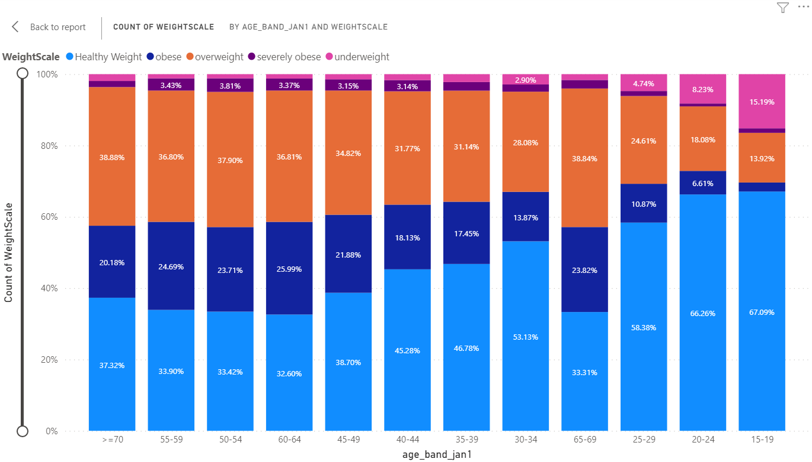
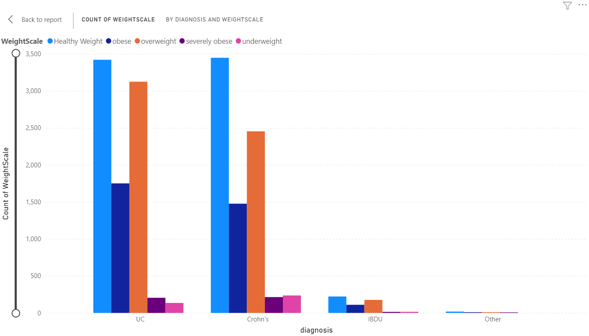
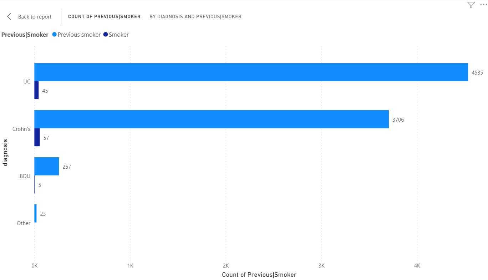
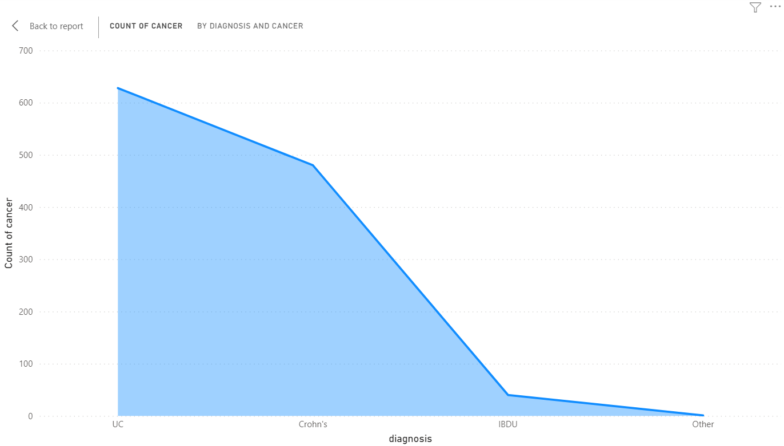
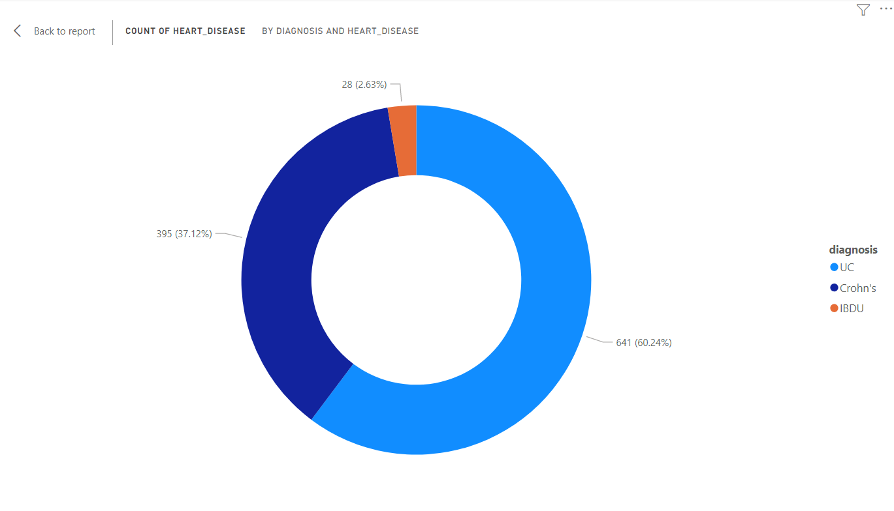
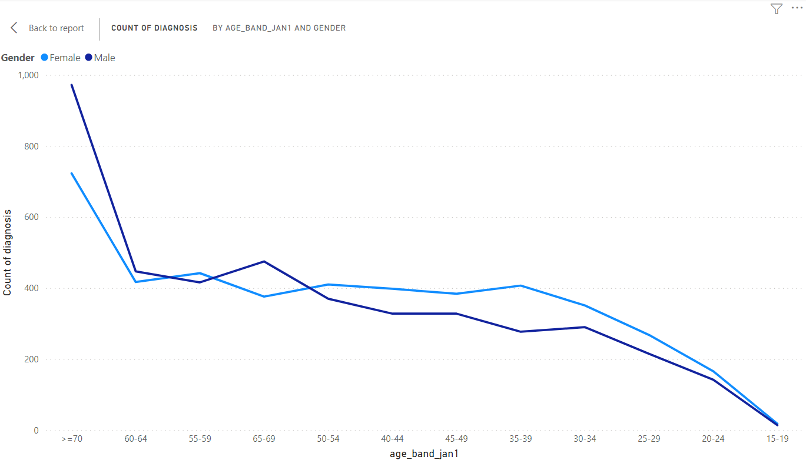

# Health survey analysis

Dataset is made up of around 33,000 patients who answered a survey about their health all participants suffer from either Crohn’s or Ulcerative colitis disease (both IBD diseases). 

The analysis contains 6 charts describing the insights needed to understand the data answering the questions in the proposal.

 
 

## Table and insight fact to show age of participants and BMI.

- Precentage stacked column chart shows age of participants categorized based on age scale and the column colorized based on weight scale and the percentage of people for each weight scale.

  

 
 

## Which type of IBD tends to have sufferers of a higher BMI?

- used clustered column chart that shows number of patients categorized based on their bmi for each type of IBD.

  

 
 

## Which type of IBD has more sufferers that smoke or previously smoked?

- used clustered bar cahrt that shows number of smokers and previous smokers for each type of IBD.

  

 
 

## Which type of IBD has more cancer sufferers ?

- used area chart that shows number of cancer sufferers for each type of IBD.

  

 
 

## Which type of IBD has more heart disease sufferers?

- used donut chart to show number of heart disease sufferers for each type of IBD.

  

 
 

## Which age group is most effected by Ulcerative colitis (diagnosis type 2 in dataset) ? (comparing male and female)

-  used line chart to show number of each age group effected by Ulcerative colitis for both male and female

  

